<div align="center">


# NEU Library Visitor Log System

**A digital check-in system built for the New Era University Library**

[](https://react.dev)
[](https://vitejs.dev)
[](https://firebase.google.com)
[](https://firebase.google.com/docs/firestore)
[](https://libraryproj-softeng.web.app)

### 🌐 [View Live Demo → libraryproj-softeng.web.app](https://libraryproj-softeng.web.app)

</div>

---

## 📖 About the Project

This started as a sprint-based Software Engineering class project, but I genuinely tried to make it something usable. The NEU Library still uses a paper logbook for visitor sign-ins — this app replaces that with a clean digital alternative where visitors sign in with their NEU Google account, pick their reason for visiting, and get logged in real time to Firestore.

There's also a full admin side: a dashboard that shows visitor stats broken down by college and visit reason, with time filters, and the ability to search any registered user and view their full visit history — or block them if needed.

---

## 🛠️ Tech Stack

| Layer | Technology | Why I used it |
|---|---|---|
| Framework | React 19 + Vite 7 | Fast dev server, component-based UI |
| Routing | React Router DOM v7 | Clean SPA navigation with protected routes |
| Auth | Firebase Authentication | Google OAuth with zero backend needed |
| Database | Cloud Firestore | Real-time NoSQL, scales with the app |
| Hosting | Firebase Hosting | Free, fast, and deploys in one command |
| Styling | Plain CSS (component-scoped) | Kept it simple, no CSS framework overhead |

---

## ✨ Features

### 🔐 Auth & Onboarding
- Google Sign-In — only `@neu.edu.ph` accounts allowed
- First-time visitors complete a quick profile: user type (Student / Faculty / Employee) and their college or office
- Auth state is persistent — no need to sign in again on every visit
- All protected routes redirect unauthenticated users back to login

### 📋 Check-In System
- Pick your reason for visiting from 6 options: Reading, Research, Use of Computer, Studying, Borrowing/Returning Books, or Other
- Check-in is written to Firestore instantly with a server-side timestamp
- Confirmation screen plays after every successful check-in

### 📊 Personal Dashboard
- Stats at a glance: visits this month, total visits, current visit streak, top reason
- Full visit history displayed as a color-coded timeline
- Borrowed books tracker — see due dates, overdue warnings, and return status
- In-app library catalog to borrow books (14-day loan period)
- Library announcements and tips sidebar

### 🛡️ Admin Dashboard
- Live visitor analytics filtered by Today / Weekly / Monthly / Custom date range
- Breakdown of visitors by college/office and visit reason (with bar chart)
- Search any user by name or email and view their full profile + visit history
- One-click Block / Unblock — blocked users see an Access Denied screen on check-in

---

## 📸 Screenshots

### Auth & Onboarding

<table>
  <tr>
    <td align="center" width="50%">
      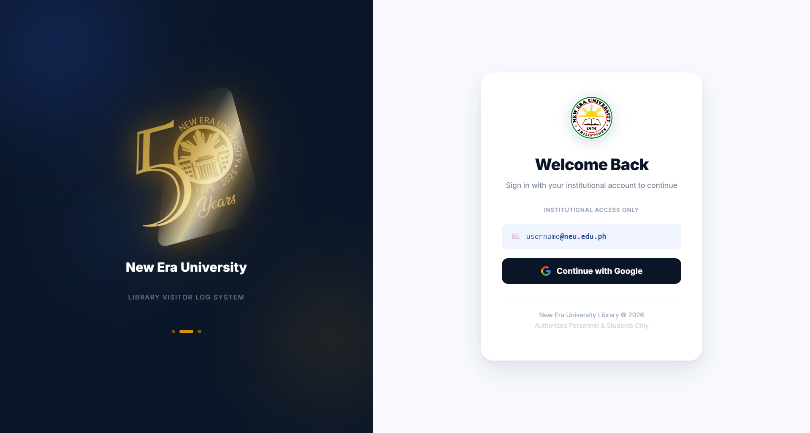
      <br /><sub><b>Login Page</b> — Google Sign-In with NEU branding</sub>
    </td>
    <td align="center" width="50%">
      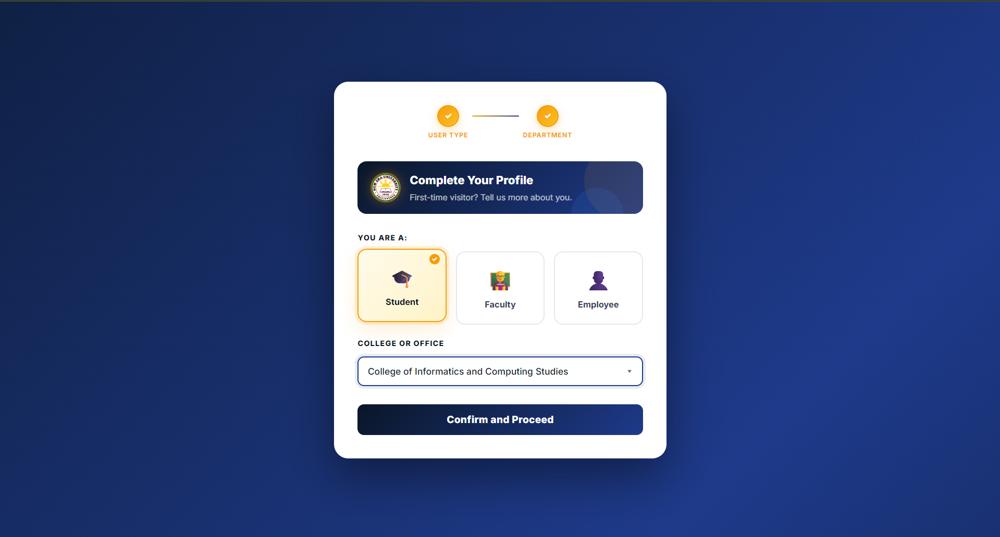
      <br /><sub><b>Onboarding</b> — First-time profile setup (user type + college)</sub>
    </td>
  </tr>
</table>

### Check-In Flow

<table>
  <tr>
    <td align="center" width="50%">
      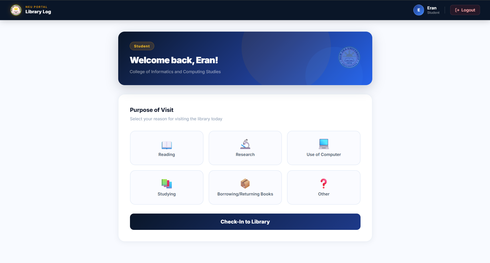
      <br /><sub><b>Check-In</b> — Select your purpose of visit</sub>
    </td>
    <td align="center" width="50%">
      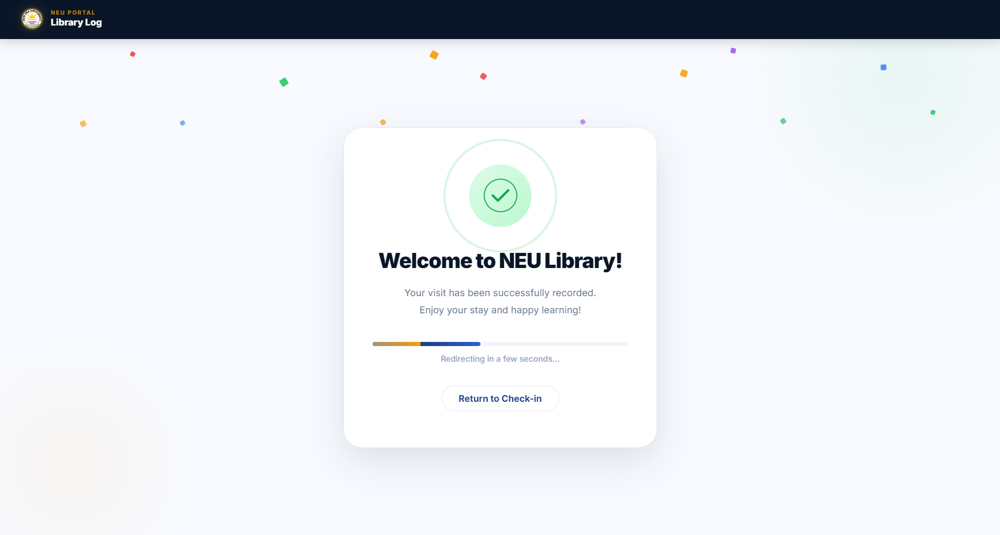
      <br /><sub><b>Welcome Screen</b> — Confirmation after a successful check-in</sub>
    </td>
  </tr>
</table>

### User Dashboard

<table>
  <tr>
    <td align="center" width="50%">
      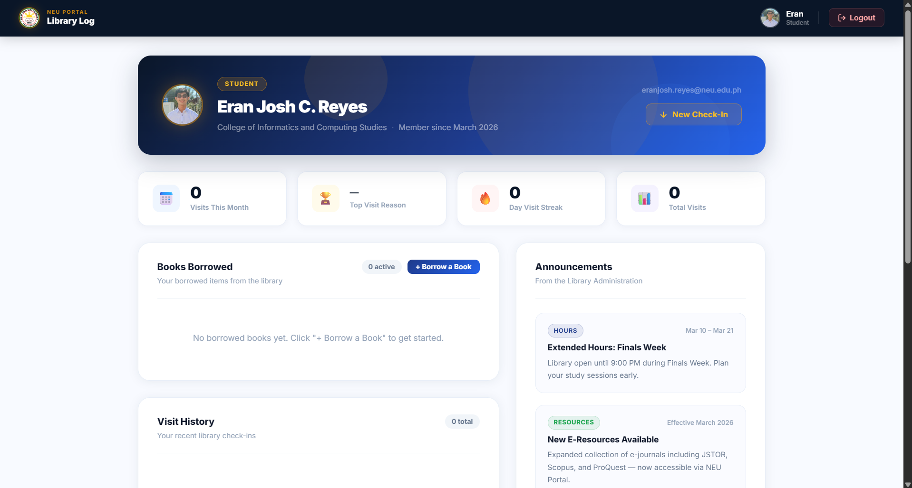
      <br /><sub><b>Dashboard</b> — Personal stats, visit history, and borrowed books</sub>
    </td>
    <td align="center" width="50%">
      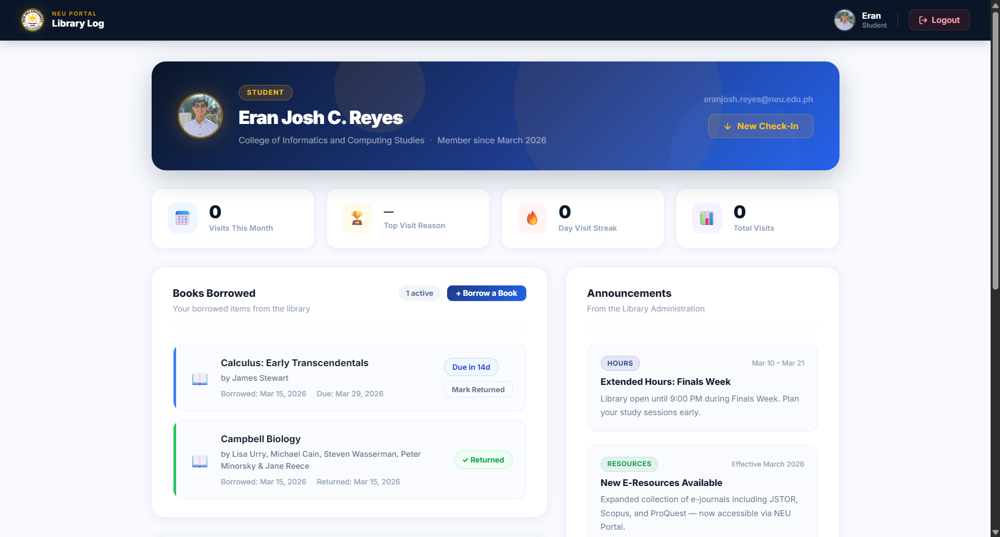
      <br /><sub><b>Borrowed Books</b> — Due dates, overdue status, and return tracking</sub>
    </td>
  </tr>
  <tr>
    <td align="center" width="50%">
      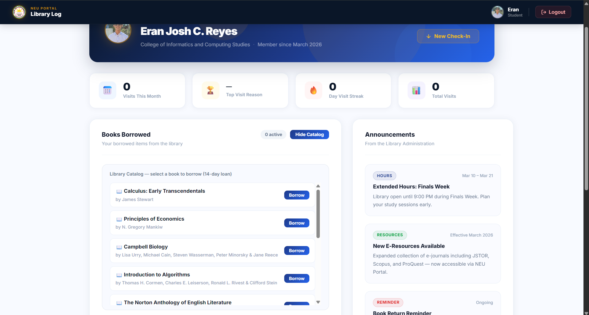
      <br /><sub><b>Library Catalog</b> — Browse and borrow books from the in-app catalog</sub>
    </td>
    <td align="center" width="50%">
      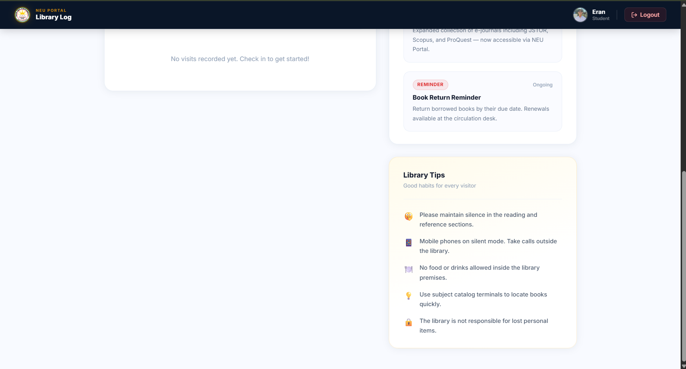
      <br /><sub><b>Sidebar</b> — Library announcements and good-habit tips</sub>
    </td>
  </tr>
</table>

### Admin Dashboard

<table>
  <tr>
    <td align="center" width="50%">
      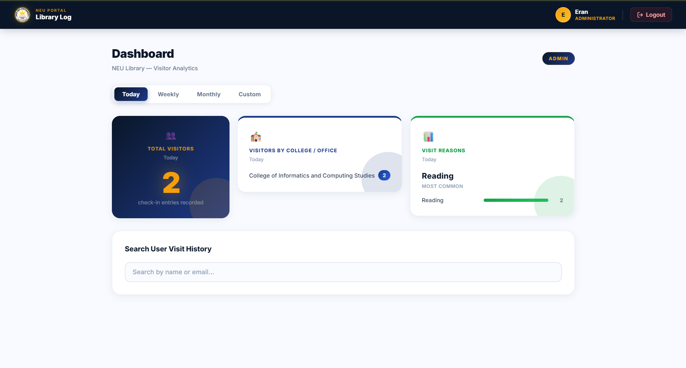
      <br /><sub><b>Analytics</b> — Visitor stats with time filter (Today / Weekly / Monthly)</sub>
    </td>
    <td align="center" width="50%">
      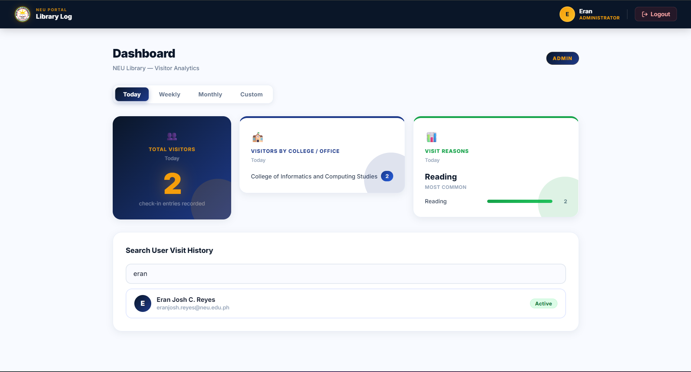
      <br /><sub><b>User Search</b> — Find any registered user by name or email</sub>
    </td>
  </tr>
  <tr>
    <td align="center" width="50%">
      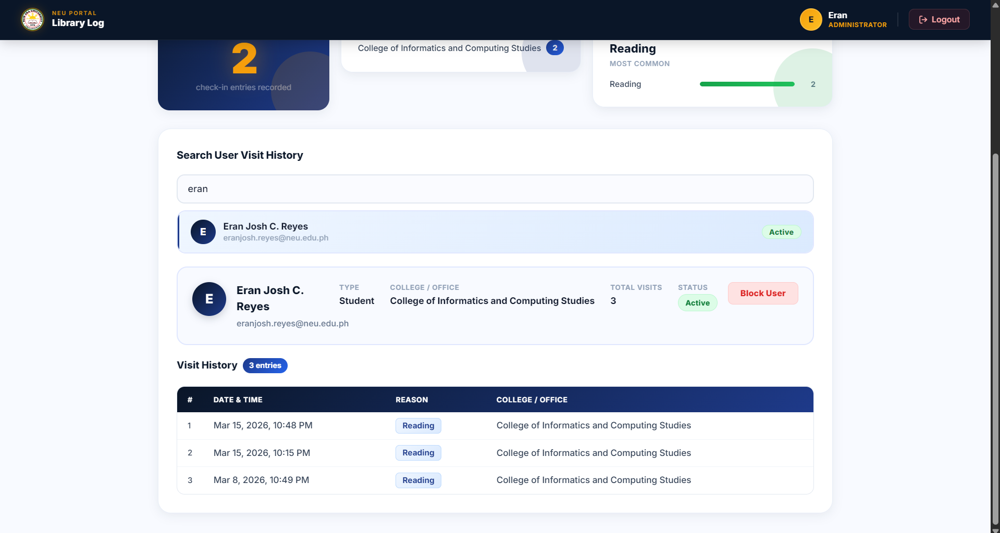
      <br /><sub><b>User Profile</b> — View full visit history and block/unblock controls</sub>
    </td>
    <td align="center" width="50%">
      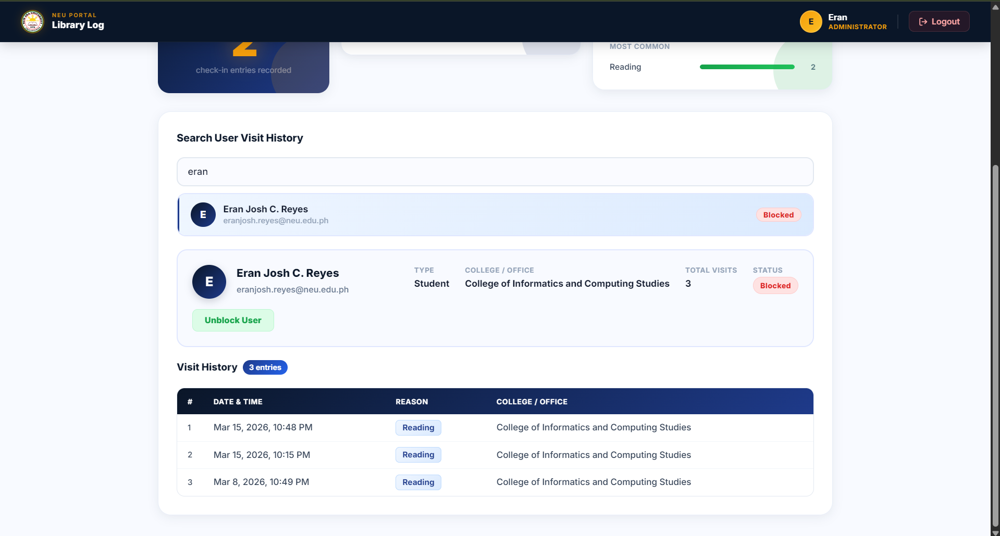
      <br /><sub><b>Blocked User</b> — Blocked status shown with unblock option</sub>
    </td>
  </tr>
</table>

---

## 🗄️ Firestore Data Model

### `users` collection
One document per registered user — document ID is the Firebase Auth UID.

| Field | Type | Description |
|---|---|---|
| `email` | `string` | Google account email |
| `fullName` | `string` | Display name from Google |
| `userType` | `string` | `"student"`, `"faculty"`, or `"employee"` |
| `college_office` | `string` | Selected department |
| `role` | `string` | `"admin"` for admins, absent for regular users |
| `isBlocked` | `boolean` | `true` if account is restricted by admin |
| `isSetupComplete` | `boolean` | `true` once onboarding is done |
| `createdAt` | `Timestamp` | Account creation time |
| `borrowedBooks` | `Array` | Borrow records (see below) |

**`borrowedBooks` item:**

| Field | Type | Description |
|---|---|---|
| `id` | `string` | Catalog book ID (e.g. `"book-3"`) |
| `status` | `string` | `"borrowed"`, `"overdue"`, or `"returned"` |
| `dateBorrowed` | `Timestamp` | Borrow date |
| `dueDate` | `Timestamp` | 14 days from borrow date |
| `returnedAt` | `Timestamp \| null` | Return date, or `null` if still out |

### `logs` collection
One document per check-in event.

| Field | Type | Description |
|---|---|---|
| `uid` | `string` | Firebase Auth UID |
| `userEmail` | `string` | Visitor's email |
| `college_office` | `string` | Department at time of check-in |
| `reason` | `string` | Purpose of visit |
| `timestamp` | `Timestamp` | Server-side check-in time |

---

## 🚀 Running Locally

### Prerequisites
- Node.js v18+
- A Firebase project with Google Auth and Firestore enabled

### Steps

**1. Clone the repo**
```bash
git clone https://github.com/EranJosh/NEU-Library-Project.git
cd NEU-Library-Project
```

**2. Install dependencies**
```bash
npm install
```

**3. Set up environment variables**

Copy the example file and fill in your Firebase credentials:
```bash
cp .env.example .env
```

Your `.env` should look like this (get the values from Firebase Console → Project Settings → Your Apps):
```env
VITE_FIREBASE_API_KEY=your_api_key_here
VITE_FIREBASE_AUTH_DOMAIN=your_project_id.firebaseapp.com
VITE_FIREBASE_PROJECT_ID=your_project_id
VITE_FIREBASE_STORAGE_BUCKET=your_project_id.firebasestorage.app
VITE_FIREBASE_MESSAGING_SENDER_ID=your_messaging_sender_id
VITE_FIREBASE_APP_ID=your_app_id
```

**4. Start the dev server**
```bash
npm run dev
```
Open `http://localhost:5173` in your browser.

---

## 📦 Deploying

This project uses Firebase Hosting. After making changes:

```bash
# Build the production bundle
npm run build

# Deploy to Firebase
firebase deploy --only hosting
```

> The `.env` file needs to be present before building — Vite embeds the `VITE_` variables into the bundle at build time.

---

## 📁 Project Structure

```
neu-library-log/
├── public/                   # Static assets (NEU logos, favicon)
├── src/
│   ├── components/
│   │   └── PrivateRoute.jsx  # Auth + admin route guard
│   ├── context/
│   │   └── AuthContext.jsx   # Global auth state via React Context
│   ├── firebase/
│   │   └── firebaseConfig.js # Firebase init (reads from .env)
│   ├── pages/
│   │   ├── LoginPage.jsx
│   │   ├── OnboardingPage.jsx
│   │   ├── CheckInPage.jsx
│   │   ├── WelcomePage.jsx
│   │   ├── DashboardPage.jsx
│   │   └── AdminDashboard.jsx
│   ├── App.jsx               # Route definitions
│   └── main.jsx              # Entry point
├── docs/
│   ├── screenshots/          # App screenshots
│   └── TECHNICAL_DOCUMENTATION.md
├── .env                      # Local secrets (gitignored)
├── .env.example              # Template for contributors
├── firebase.json             # Hosting config
└── vite.config.js
```

---

## 📚 Documentation

For a deeper dive into the system architecture, all user flows, Firestore security rules, and known limitations, check out the [Technical Documentation](docs/TECHNICAL_DOCUMENTATION.md).

---

## 👤 Author

<table>
  <tr>
    <td>
      <strong>Eran Josh C. Reyes</strong><br />
      New Era University<br />
      College of Informatics and Computing Studies<br />
      Software Engineering — Academic Year 2025–2026
    </td>
  </tr>
</table>
